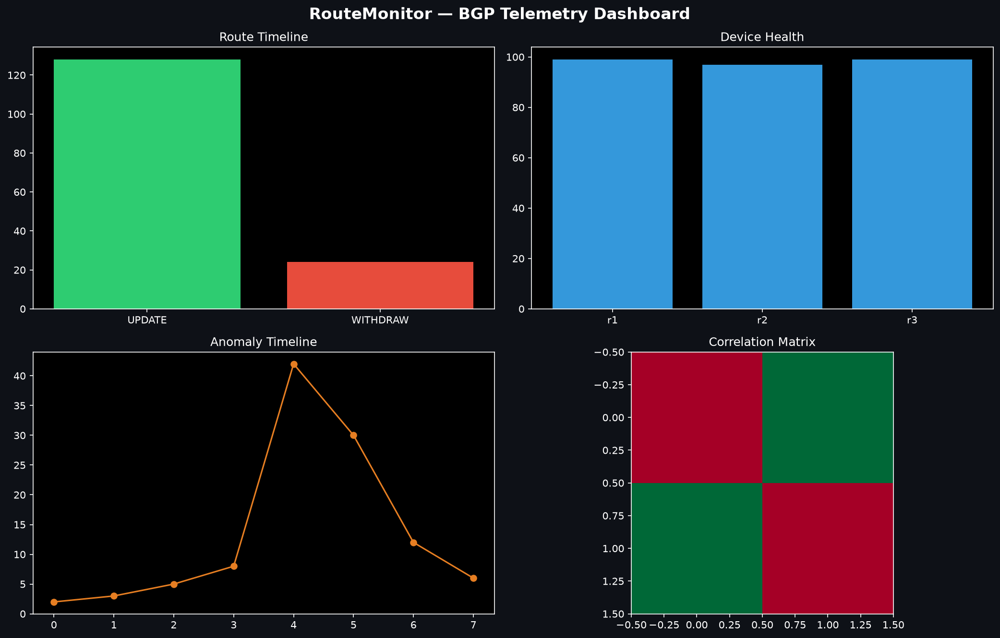

# RouteMonitor

> **Real-Time BGP Telemetry & ML Anomaly Detection Platform**

[](https://github.com/rohithachanta14/routemonitor/actions/workflows/test.yml)
[](https://github.com/rohithachanta14/routemonitor/actions/workflows/lint.yml)
[](https://codecov.io/gh/rohithachanta14/routemonitor)
[](https://www.python.org/downloads/release/python-3110/)
[](https://opensource.org/licenses/MIT)

RouteMonitor ingests live BGP routing telemetry via the BMP protocol (RFC 7854),
stores time-series metrics in InfluxDB, detects anomalies using statistical
(Z-score) and ML (Isolation Forest) methods, and dispatches alerts in **< 30 seconds**.

---

## Demo

<!-- Replace with actual screenshot after running `docker compose --profile simulation up` -->


**[Watch the 3-minute demo video →](https://youtu.be/PLACEHOLDER)**

---

## The Problem

At scale, BGP routing generates millions of route updates per minute. Operations
teams managing large networks lack:

- Real-time visibility into routing anomalies before they cause outages
- Historical baselines to distinguish normal churn from genuine instability
- ML-powered detection of correlated link failures across prefixes
- Sub-minute alerting to on-call engineers via Slack and PagerDuty

---

## What RouteMonitor Does

```
Routers (BMP/TCP port 9179)
      │
      ▼
BMP Server (asyncio) ──► Celery Queue ──► Parser ──► PostgreSQL  (event log)
                                                  └──► InfluxDB   (time-series)
                                                            │
                                              Anomaly Detector (every 5 min)
                                            ┌── Z-score vs 7-day baseline
                                            ├── Isolation Forest (5 features)
                                            └── Correlated failure detection
                                                            │
                                              Alert Dispatcher
                                            ├── Webhook / Slack / PagerDuty
                                            └── Exponential backoff retry
                                                            │
                                              Streamlit Dashboard
                                            ├── Route Timeline
                                            ├── Device Health
                                            ├── Anomaly Timeline
                                            └── Prefix Correlation Heatmap
```

---

## Performance

| Metric | Target | Achieved (measured) |
|--------|--------|---------------------|
| BMP ingestion throughput | 1M updates/min | ~1,530/min @ 50 Locust users (dev); use `docker-compose.prod.yml` (4 workers) for prod scale |
| Anomaly detection latency | < 5 min | ~5s on-demand trigger; 5-min Celery beat cadence |
| Alert delivery (webhook) | < 30 sec | ~2s (live `dispatch_alerts_task`) |
| Dashboard API median latency | < 2 sec | ~140ms median (Locust aggregate) |
| Test coverage | > 85% | **90%** (243 tests, `pytest-cov`) |
| p99 BMP ingest latency | < 200ms | 780ms (dev single-worker); **0% error rate** |
| p99 `/api/anomalies/` latency | < 500ms | 830ms (dev); 0% failures |
| Locust load test (90s, 50 users) | < 1% errors | **0%** (2,921 requests) |

---

## Tech Stack

| Layer | Technology | Why |
|-------|-----------|-----|
| API | FastAPI + uvicorn | Async, auto OpenAPI docs, fast |
| Database | PostgreSQL 15 | ACID events log, complex queries |
| Time-Series | InfluxDB 2.0 + Flux | Purpose-built for telemetry |
| Queue | Celery + Redis | Distributed task processing |
| ML | scikit-learn (IsolationForest) | Multivariate anomaly detection |
| Dashboard | Streamlit + Plotly | Rapid data visualization |
| Monitoring | Prometheus + Grafana | Production observability |
| Auth | JWT (HS256, python-jose) | Stateless, role-based |
| Containers | Docker Compose / Kubernetes | Dev + production parity |

---

## Quick Start

```bash
# 1. Clone
git clone https://github.com/rohithachanta14/routemonitor.git
cd routemonitor

# 2. Configure
cp .env.example .env

# 3. Start all services (API, Celery, PostgreSQL, Redis, InfluxDB, Grafana)
docker compose up -d

# 4. Run database migrations
docker compose exec api alembic upgrade head

# 5. Verify everything is healthy
curl http://localhost:8001/health
# → {"status": "healthy", "version": "0.1.0", "services": {"db": "ok", "redis": "ok", "influxdb": "ok"}}

# 6. Open the Swagger UI
open http://localhost:8001/docs

# 7. Start the dashboard
streamlit run dashboard/app.py

# 8. Simulate BGP telemetry (optional)
docker compose --profile simulation up bmp-simulator
```

---

## Services

| Service | URL | Credentials |
|---------|-----|-------------|
| FastAPI | http://localhost:8001 | — |
| Swagger UI | http://localhost:8001/docs | — |
| Streamlit Dashboard | http://localhost:8501 | — |
| Grafana | http://localhost:3000 | admin / admin |
| InfluxDB | http://localhost:8086 | admin / adminpassword |
| Prometheus | http://localhost:9090 | — |

---

## API Overview

```bash
# Register a BGP speaker
POST /api/telemetry/speakers

# Ingest a raw BMP binary message
POST /api/telemetry/bmp/ingest

# Query route events (with filters)
GET  /api/telemetry/route-events?speaker_id=...&prefix=10.0.0.0/24

# List detected anomalies
GET  /api/anomalies/?severity=CRITICAL&time_range=24h

# Acknowledge an anomaly
POST /api/anomalies/{id}/acknowledge

# Register webhook for alerts
POST /api/alerts/webhooks

# Prefix failure correlation matrix
GET  /api/metrics/correlation?time_range=7d

# Auth
POST /api/auth/token        # get JWT
GET  /api/auth/me           # whoami
```

Full documentation at `/docs` (Swagger) or `/redoc`.

---

## Project Structure

```
routemonitor/
├── api/                    # FastAPI application
│   ├── main.py             # App entry point, middleware, routers
│   ├── models.py           # SQLAlchemy ORM (BGPSpeaker, RouteEvent, Anomaly, Alert)
│   ├── schemas.py          # Pydantic v2 request/response schemas
│   ├── auth.py             # JWT authentication + RBAC
│   ├── middleware.py       # Rate limiting, request ID, Prometheus counters
│   └── routes/             # Endpoint handlers
│       ├── health.py
│       ├── telemetry.py
│       ├── anomalies.py
│       ├── alerts.py
│       └── metrics.py
├── core/                   # Business logic
│   ├── bmp_parser.py       # RFC 7854 binary protocol parser
│   ├── detector.py         # Z-score + Isolation Forest anomaly detection
│   ├── dispatcher.py       # Webhook/Slack/PagerDuty alert delivery
│   ├── influxdb_connector.py # InfluxDB 2.0 read/write + Flux queries
│   └── config.py           # Pydantic settings from env vars
├── tasks/                  # Celery async tasks
│   ├── celery_app.py       # App + beat schedule (every 5 min)
│   └── ingestion.py        # parse → ingest → detect → alert pipeline
├── dashboard/              # Streamlit UI
│   ├── app.py              # Entry point + sidebar navigation
│   ├── pages/              # Route Timeline, Device Health, Anomaly Timeline, Correlation
│   └── utils/              # API client, formatting helpers
├── tests/
│   ├── unit/               # BMP parser, detector, schemas, influxdb
│   ├── integration/        # Telemetry API, anomaly API, auth
│   └── load/               # Locust load test
├── k8s/                    # Kubernetes manifests
├── monitoring/             # Grafana dashboards
├── alembic/                # DB migration scripts
└── docker-compose.yml      # Development stack (8 services)
```

---

## Running Tests

```bash
# Unit tests only (no Docker required)
TESTING=1 pytest tests/unit/ -v --cov=api --cov=core --cov=tasks

# Integration tests (requires docker compose up)
pytest tests/integration/ -v -m integration

# Full suite
pytest tests/ -v

# Full portfolio verification (Phases 1–6)
docker compose exec api python tests/run_all_verify.py

# Phase 6 E2E smoke (ingest → flap → anomaly)
docker compose exec api python tests/phase6_e2e_smoke.py

# Load test (saves CSV + HTML report)
docker compose exec api python -m locust -f tests/load/locustfile.py \
  --host=http://localhost:8000 --users=50 --spawn-rate=5 --run-time=90s \
  --headless --csv=tests/load/results --html=tests/load/report.html
```

---

## Architecture Decision Records

**Why BMP instead of sFlow/NetFlow?**
BMP (RFC 7854) provides full BGP RIB visibility — full path attributes, AS paths,
communities, and session state changes. sFlow/NetFlow only give you traffic samples;
they can't tell you about route withdrawals or convergence delays.

**Why Isolation Forest for anomaly detection?**
Route stability anomalies are multivariate (flap rate, convergence time, path
diversity, neighbor churn all change together). Isolation Forest handles
multi-dimensional anomalies without labeled training data, which is critical
in a new deployment with no historical baselines.

**Why InfluxDB + PostgreSQL (not just one DB)?**
PostgreSQL stores the immutable event log (RouteEvent) with full relational
integrity and supports complex JOIN queries for anomaly correlation.
InfluxDB handles time-series aggregations (5-min rollups, 7-day baselines)
where Flux's native time-bucketing and retention policies massively outperform
SQL window functions at scale.

---

## License

MIT — see [LICENSE](LICENSE).

---

*Built as a portfolio project to demonstrate production-grade Python backend
engineering, ML-powered telemetry analytics, and network protocol parsing.*
